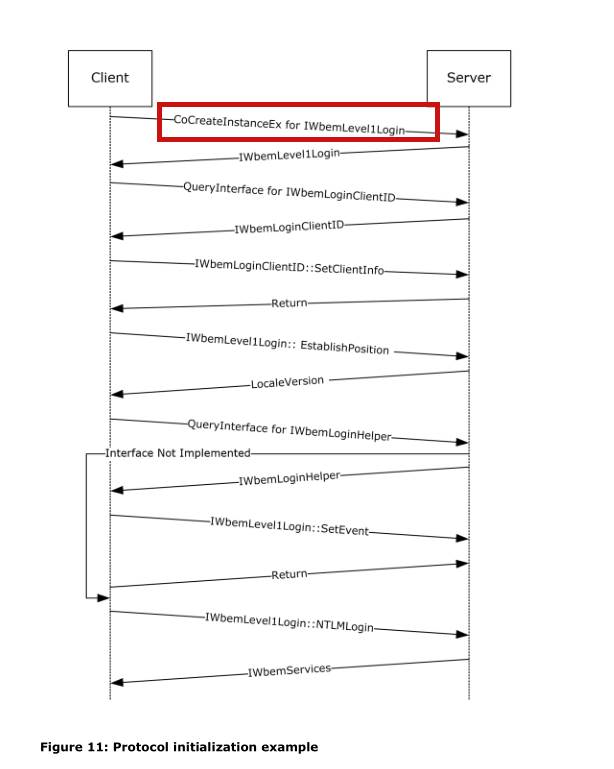
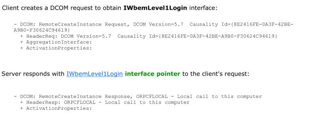
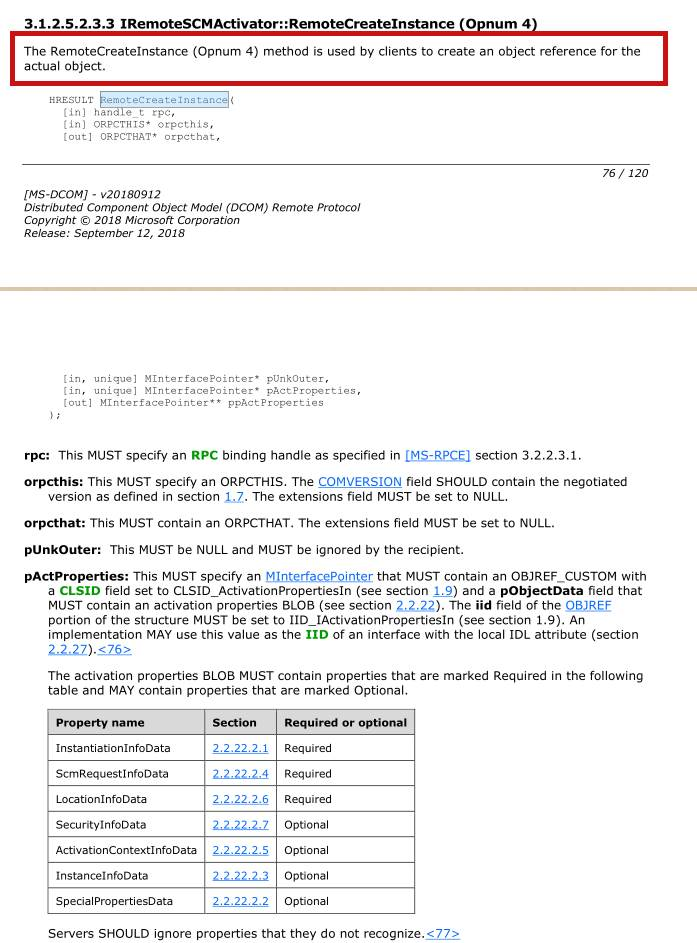
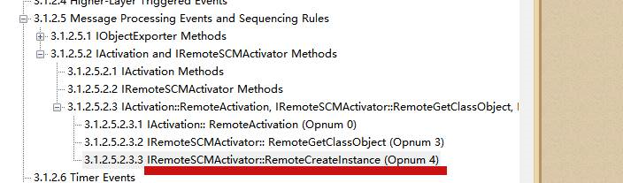
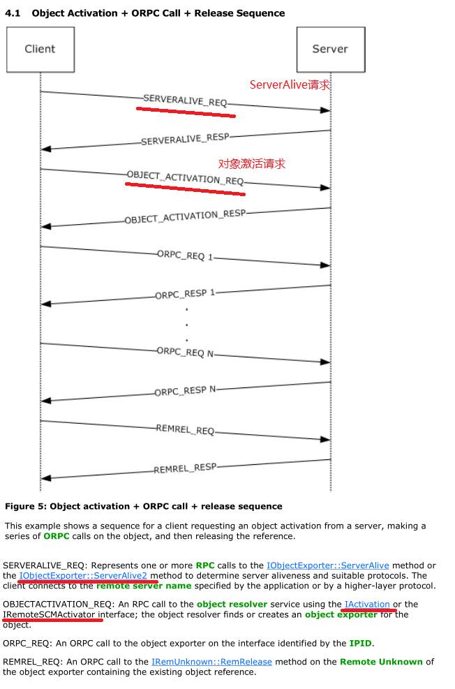
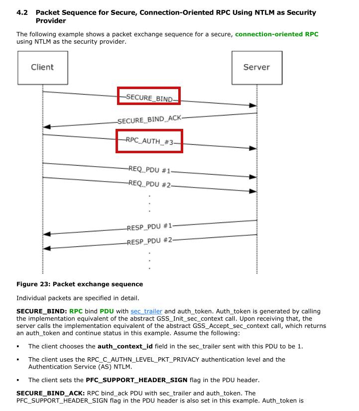
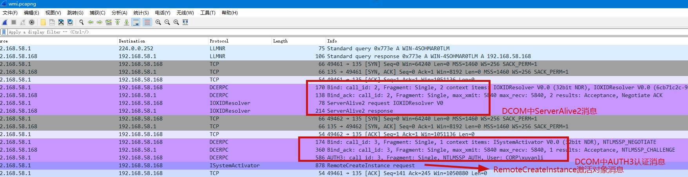
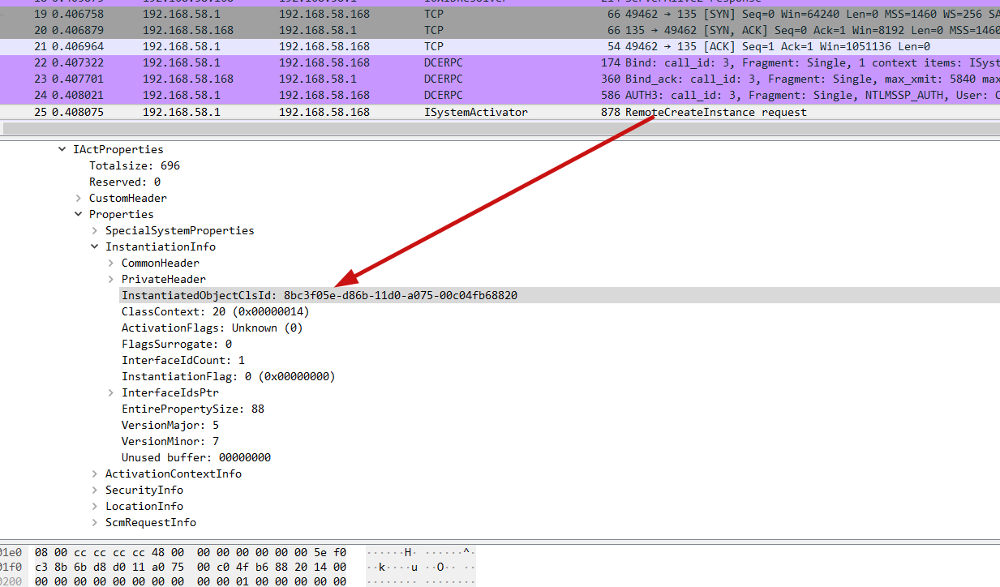
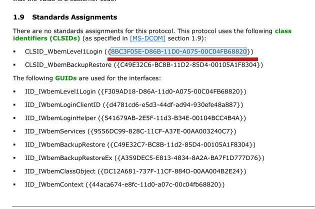

## 本文涉及到的协议
```
[MS-RPCE]
[MS-DCOM]
[MS-WMI]
```

## 概述
windows中的很多协议，都是嵌套的。有时候为了去明白上层的一些协议，需要去深入看下，比较底层的协议实现。就比如wmi是依赖dcom和rpc的。这些在wmi的协议中都有很好的说明。下面通过一段简单的代码，探究下这个过程的实现。


## 交互过程
先来看一段简单的代码，在调用com接口前，需要调用CoCreateInstance函数创建对象，之后再调用相应的方法。
```
CoCreateInstance(CLSID_WbemLocator, 0, CLSCTX_INPROC_SERVER, IID_IWbemLocator, (LPVOID *)&pLoc);
```

从协议的角度来说，下图是一个完整的过程



首先来看[MS-WMI]是如何对这一过程解释的


通过解释，可以明白的是，客户端会发送 DCOM  RemoteCreateInstance  在这个请求中会附带 IWbemLevel1Login消息。而这个请求在DCOM层又是怎么发送的呢？现在转到[MS-DCOM]协议


该接口是属于IRemoteSCMActiator下的一个函数。


下面深入看下dcom的交互过程


通过红线标红的解释，发现正是第二个过程。单是因为该过程又是基于RPC的，下面转到[MS-RPCE]这个文档去确认点东西。Rpc的交互过程是这样的


第一步是会发送bind消息，之后如果需要认证的话，需要发送AUTH3认证消息。结合上面那么多的讲解，那么一个完整的过程应该是怎么样的呢？借助于wireshark来说明整个过程。


## dcom调用方法的过程
从上图可以看出来，一个完整的dcom-rpc方法调用，需要经过两步，
```
bind        指定方法所在的类（通知指定某一个类的guid来确定要调用的类）
request     调用bind阶段类中的某一个方法(通过 opnum 来确定)
```

## wmi方法的调用
因为wmi是依赖dcom的，所以wmi的数据是封装在dcom交互的request中的。
例如 CoCreateInstance会触发dcom的RemoteCreateInstance




这里面出现了一个clsid。在[MS-WMI]协议手册中，可以看到这个id的说明，正是wmi请求的第一个login时机的clsid。


具体的一些调用参数，也是会存放在request的数据中。

## 结尾
出于一些监控或者拦截的目的，从协议下手也是一个很好的方法。像wmi，远程计划任务等等。大多数远程交互，windows都是提供了很完备的资料，循着这些资料以及手工分析下，还是有很多很好的点可以利用或者学习。


[Microsoft Protocols : https://docs.microsoft.com/en-us/openspecs/protocols/ms-protocolslp/9a3ae8a2-02e5-4d05-874a-b3551405d8f9](https://docs.microsoft.com/en-us/openspecs/protocols/ms-protocolslp/9a3ae8a2-02e5-4d05-874a-b3551405d8f9)


